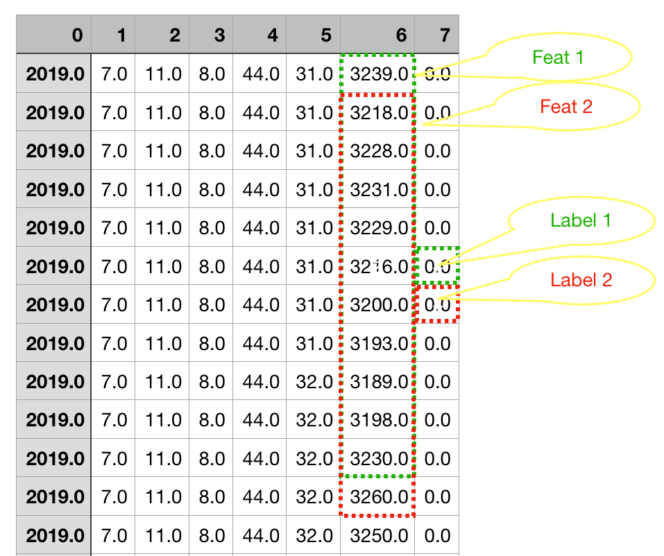

## Requirement
>
* python >= 3.6.9
* pytorch >= 1.1.0
* numpy
* sklearn

## Definition
#### Parameter `w_width`

> Above is a example with w_width = 11, which is how the training data is generated. Using this slidding window to roll over all data samples to create the dataset, then split it into training and validation set at proportion of 3:1.

## Training
### Usage
`$ python nn.py --epochs [training epochs]  --w-width [squence length]`
####
**Example:**
`$ python nn.py --epochs 20 --w-width 144`

**If you have gpu:**
`$ python nn.py --epochs 20 --w-width 144 --cuda`

**Try `python nn.py --help` for more help**

## Inference
### Usage
`$ python nn.py --inference --checkpoint [checkpoint.pth] --input [csv file]`
### Example

`$ python nn.py --inference --checkpoint checkpoints/epoch_20_0.893.pth --input fanchu_data/20190725_6008_04.csv `
*Will genereate a prediction file fanchu_data/20190725_6008_04.predict.predict.csv*

### Experiment
| w_width | Accuracy |
|:-------:|:--------:|
|    36   |   0.852  |
|    64   |   0.867  |
|   100   |   0.884  |
|   144   |   0.895  |